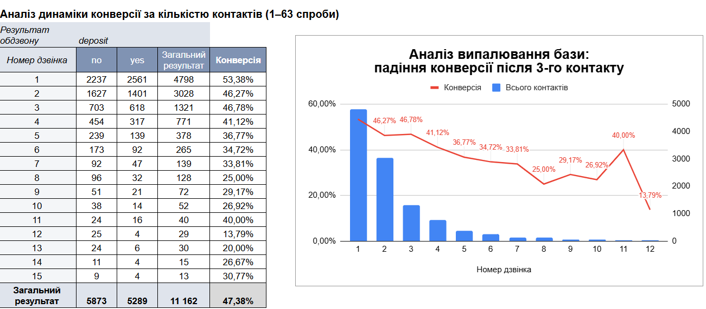

# bank-marketing-analysis
# Аналіз ефективності маркетингової кампанії банку: оптимізація телефонних продажів депозитів

## 1. Опис проекту та бізнес-задача
**Джерело даних:** Kaggle (Bank Marketing Dataset) — 11 162 записи, 17 колонок. Дані статичні, оновлення не планується.
**Бізнес-мета:** Проаналізувати результати телефонного обдзвону клієнтів щодо відкриття довгострокових депозитів, визначити фактори максимальної конверсії та надати рекомендації для оптимізації роботи контакт-центру.

## 1.1. Методологія, аналітичні методи та візуалізація

Під час роботи над цим проектом було застосовано комплексний підхід до аналізу даних (Data-Driven Approach), який включав такі етапи та методи:

### 🧠 Аналітичні методи:
*   **Оцінка якості даних (Data Quality Assessment):** Аудит датасету на наявність дублікатів, аномалій та прихованих пропусків (маскованих під текстові маркери `unknown`).
*   **Конверсійний аналіз (Conversion Rate Analysis):** Розрахунок показників ефективності (CR) для кожного етапу маркетингової воронки та кроків кампанії.
*   **Сегментація клієнтської бази (Customer Segmentation):** Розподіл клієнтів на однорідні групи за демографічними ознаками (вік, освіта, професія) та наявністю фінансових зобов'язань.
*   **Крос-аналіз факторів (Cross-Feature Synergy):** Дослідження взаємозв'язку між історією взаємодії клієнта з банком (CRM-маркетинг) та поточним кредитним навантаженням.
*   **Розробка бізнес-рекомендацій:** Трансформація числових аномалій та інсайтів у конкретні управлінські рішення для оптимізації роботи контакт-центру.

### 📊 Візуалізація та інструменти:
*   **KPI-дашборд:** Розробка інтерактивної панелі індикаторів у Google Таблицях для швидкого моніторингу головних бізнес-метрик банку (конверсія, фінансовий профіль, тривалість розмов).
*   **Комбіновані графіки (Combo Charts з Dual Axis):** Створення діаграм із двома вертикальними осями для одночасного відображення обсягів вибірки та відсоткових показників (конверсії).
*   **Гістограми розподілу:** Візуалізація структури закредитованості клієнтів за віковими групами.
*   **Складні функції Google Sheets:** Автоматизація розрахунків та динамічний переклад даних за допомогою зв'язок функцій `BYROW`, `LAMBDA`, `UNIQUE`, `SORT`, `SWITCH` та `QUERY`.

---

## 2. Оцінка якості даних 
Перед початком аналізу було проведено аудит чистоти датасету:
* Повні дублікати рядків та технічні пустоти (порожні комірки) відсутні.
* Виявлено значний обсяг пропущених значень, маскованих під текстовий маркер `"unknown"`.
* Найбільш критичний пропуск зафіксовано в ознаці **`poutcome` (результат попереднього контакту) — 74,59%**, та **`contact` (тип зв'язку) — 21,02%**. Рівень освіти (`education`) не вказано у 4,45% клієнтів.

---

## 3. Ключові інсайти та результати аналізу

### Етап 1. Оптимізація кількості контактів (Ефект «випалювання бази»)
Аналіз залучення депозитів залежно від кількості спроб зв'язку (від 1 до 63 дзвінків) показав стрімке падіння ефективності:
* **1–3 дзвінки:** Золоте вікно продажів. Конверсія тримається на піковому рівні (**53,38%** на першому дзвінку, **46,27%** та **46,78%** на другому та третьому відповідно). На цей етап припадає понад 80% усіх залучених депозитів.
* **4–5 дзвінки:** Ефективність стрімко падає до **41,12%** та **36,77%**.
* **6+ дзвінків:** Конверсія котиться вниз, оскільки відображає поодинокі згоди на фоні виснаження бази.

> **💡 Бізнес-рекомендація:** Встановити ліміт у CRM-системі — **не більше 3 спроб обдзвону одного клієнта** в межах однієї кампанії. Подальші контакти неефективно витрачають робочий час операторів та викликають негатив у клієнтів.
> 
> *:* **Комбінована діаграма (Combo Chart)**. Стовпчики — «Всього дзвінків», лінія (на правій осі) — «Конверсія, %».

### Етап 2. Аналіз історії взаємодії (CRM-ефект)
Через те, що 74,59% бази складають нові клієнти (категорія `unknown`), базу було розділено на «холодний» та «теплий» сегменти:
* Нові клієнти без історії демонструють базову конверсію — **40,67%**.
* Клієнти, які мали **успішний досвід у минулому (`success`)**, купують повторно з надзвичайно високою конверсією — **91,32%**.
* Навіть клієнти з минулим **негативним досвідом (`failure`)** повертаються з конверсією **50,33%**, що вище, ніж у абсолютно нових людей.

### Етап 2.1. Віковий розподіл залучення депозитів серед клієнтів З ІПОТЕКОЮ
Дослідження фінансової поведінки закредитованих клієнтів (тих, хто має відкритий житловий кредит — `housing = yes`) показують, що наявність іпотеки не виключає готовність клієнтів формувати заощадження.

| Вікова група | Відмова від депозиту | Оформили депозит | Всього з іпотекою | Конверсія в депозит |
| :--- | :---: | :---: | :---: | :---: |
| **18 - 25** | 305 | 145 | 450 | **32,22%** |
| **26 - 33** | 1449 | 1545 | 2994 | **51,60%** |
| **34 - 41** | 1285 | 1765 | 3050 | **57,87%** |
| **42 - 49** | 1003 | 1000 | 2003 | **49,93%** |
| **50 - 57** | 937 | 605 | 1542 | **39,23%** |
| **58 - 65** | 521 | 204 | 725 | **28,14%** |
| **> 65** | 381 | 17 | 398 | **4,27%** |
| **ЗАГАЛОМ** | **5881** | **5281** | **11162** | **47,31%** |

*\*Примітка: ця таблиця відфільтрована виключно за клієнтами з наявною іпотекою. Стовпчик «no» означає відмову від відкриття депозиту, а стовпчик «yes» — успішне оформлення депозиту.*

* **Аналіз тренду:** Клієнти з іпотекою у найбільш активному працездатному віці (**26–49 років**) демонструють найвищу конверсію серед досліджених вікових груп — від **50% до 57,87%** (з піком у групі 34–41 рік). Закредитована зріла аудиторія охоче відкриває депозити (імовірно, для формування фінансової подушки безпеки).
* **Критичні точки:** Для молоді (32,22%) та особливо для пенсіонерів старше 65 років іпотека є непосильним фінансовим тягарем. Конверсія літніх людей з іпотекою падає практично до нуля (**4,27%**, всього 17 успішних кейсів із 398).

### Етап 2.2. Крос-аналіз: Синергія іпотечного навантаження та маркетингової історії
Зіставлення структури закредитованості бази та конверсії в депозит виявило стійкі взаємозв'язки між фінансовим навантаженням клієнтів та результативністю кампанії:

*   **Парадокс категорії `success` (Лояльність понад усе):** Лише **26,42%** лояльних клієнтів мають іпотечне навантаження. Проте, коли банк контактує з цією закредитованою групою, рівень довіри повністю нівелює фактор боргу — конверсія злітає до абсолютного максимуму по банку — **87,99%**.
*   **Причина минулих провалів у категорії `failure`:** Крос-аналіз показав, чому минулі маркетингові кампанії для цієї групи завершилися невдачею. Цей сегмент має найвищу закредитованість у банку — **59,77%** клієнтів обтяжені іпотекою. Оскільки їхнє фінансове становище не змінилося, повторні «холодні» дзвінки дають низьку конверсію (**39,24%**). Банк фактично витрачає ресурси на аудиторію, яка фізично не має вільних коштів.
*   **Низька ефективність роботи з холодною базою (`unknown`):** Майже половина нових клієнтів (**48,02%**) мають відкриту іпотеку. Спроби продати їм депозит без попередньої історії взаємодії демонструють найнижчу ефективність — всього **32,14%** конверсії при гігантських витратах часу операторів (3 998 дзвінків).

> **💡 Рекомендований графік:** **Двопанельний комбінований графік (Dual-Axis Combo Chart)**. Стовпчики (ліва вісь) показують рівень закредитованості сегмента (пік на `failure` — 59%), а лінія тренду (права вісь) відображає дзеркальну конверсію в депозит (пік на `success` — 87%). Графік візуально доводить антикореляцію: що вища закредитованість групи, то гірше вона купує депозити (окрім суперлояльного сегмента).

---

## 4. Загальний висновок для менеджменту банку
Загальна конверсія кампанії становить **47,38%**. Для оптимізації бюджету та підвищення прибутковості необхідно:
1. **Змінити фокус обдзвону:** Перенаправити ресурс операторів з «холодного» обдзвону нових закредитованих клієнтів (категорія `unknown`) на повторні продажі лояльній базі (`success`), яка гарантує надвисокий результат навіть за наявності іпотеки.
2. **Впровадити CRM-фільтри:** Розглянути виключення з депозитних кампаній сегмента 65+ із чинною іпотекою через низьку результативність.
3. **Автоматизувати ліміти контактів:** Доцільно протестувати обмеження кількості контактів до трьох спроб, оскільки після цього порогу спостерігається стабільне зниження конверсії.
